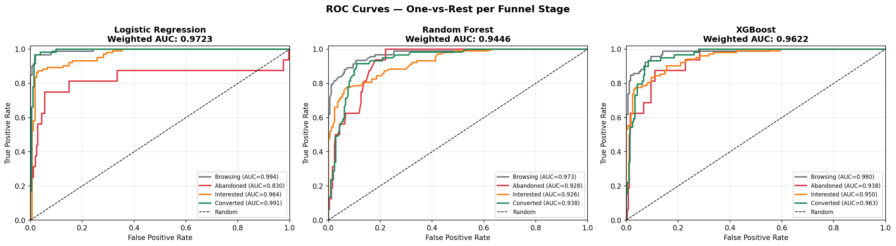
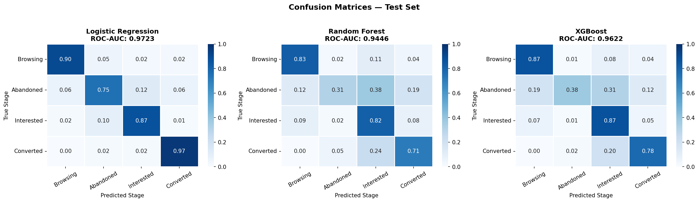
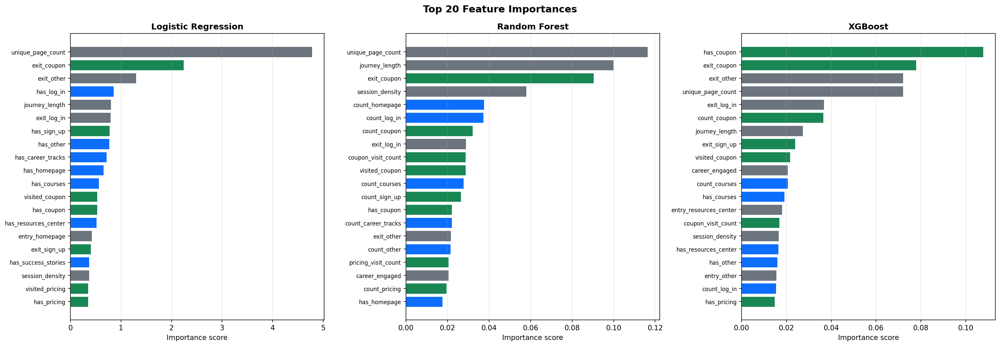
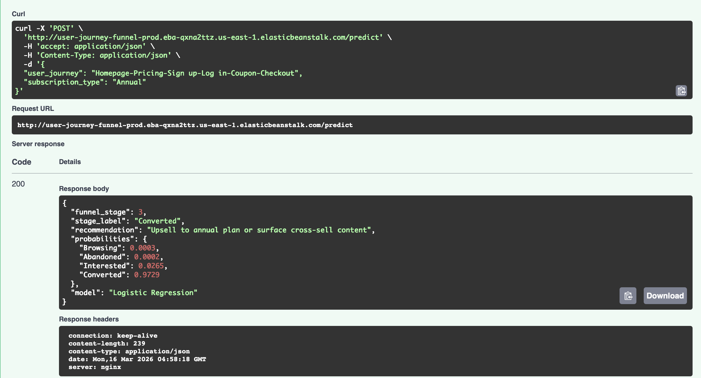

# User Journey Funnel Stage Predictor

A funnel stage classifier that predicts where a user is in the purchase journey — browsing, interested, abandoned, or converted — from their clickstream sequence, enabling targeted business interventions per segment.

**Live API:** [user-journey-funnel-prod.eba-qxna2ttz.us-east-1.elasticbeanstalk.com/docs](http://user-journey-funnel-prod.eba-qxna2ttz.us-east-1.elasticbeanstalk.com/docs)

---

## What It Does

Given a sequence of pages a user visited — for example `Homepage-Pricing-Sign up-Log in-Coupon-Checkout` — the model predicts which of four funnel stages they belong to and returns a recommended action:

| Stage | Label | Recommended Action |
|-------|-------|--------------------|
| 0 | Browsing | Show discovery content |
| 1 | Abandoned | Trigger re-engagement campaign |
| 2 | Interested | Offer incentive to convert |
| 3 | Converted | Upsell or request review |

---

## Pipeline Overview

```
Raw clickstream CSV
        │
        ▼
 spark_pipeline.py          (PySpark ETL — offline batch)
 - Remove consecutive duplicate pages
 - Reconstruct sessions from raw events
 - Engineer 67 features per user journey
        │
        ▼
 model_training.ipynb       (scikit-learn + XGBoost)
 - Logistic Regression, Random Forest, XGBoost
 - 5-fold cross-validation
 - Best model saved to model_artifacts/
        │
        ▼
 FastAPI REST API            (deployed on AWS Elastic Beanstalk)
 - POST /predict  → funnel stage + probabilities + recommendation
 - GET  /health   → model status
 - GET  /model-info → model metadata
```

---

## Model Performance

| Model | Test ROC-AUC | CV ROC-AUC | Accuracy | Weighted F1 |
|-------|-------------|------------|----------|-------------|
| **Logistic Regression** | **0.9723** | 0.9721 ± 0.008 | 89.6% | 0.9045 |
| XGBoost | 0.9622 | 0.9620 ± 0.006 | 82.2% | 0.8177 |
| Random Forest | 0.9446 | 0.9407 ± 0.010 | 76.7% | 0.7641 |

Logistic Regression was selected as the production model based on highest ROC-AUC and F1 score.

### ROC Curves


### Confusion Matrices


### Feature Importance


---

## Tech Stack

- **Feature engineering:** PySpark 3.5, pandas, custom UDFs
- **Modelling:** scikit-learn, XGBoost
- **API:** FastAPI, Pydantic v2, uvicorn
- **Deployment:** AWS Elastic Beanstalk (Python 3.12 on AL2023), nginx
- **CI/CD:** GitHub Actions — tests gate every deploy to main

---

## API Usage

**Interactive Swagger UI:** [/docs](http://user-journey-funnel-prod.eba-qxna2ttz.us-east-1.elasticbeanstalk.com/docs)



Or call it directly:

```bash
curl -X POST http://user-journey-funnel-prod.eba-qxna2ttz.us-east-1.elasticbeanstalk.com/predict \
     -H "Content-Type: application/json" \
     -d '{"user_journey": "Homepage-Pricing-Sign up-Log in-Coupon-Checkout",
          "subscription_type": "Annual"}'
```

**Response:**
```json
{
  "funnel_stage": 3,
  "stage_label": "Converted",
  "recommendation": "Upsell or request review",
  "probabilities": {
    "Browsing": 0.0021,
    "Abandoned": 0.0014,
    "Interested": 0.0472,
    "Converted": 0.9493
  },
  "model": "Logistic Regression"
}
```

---

## Run Locally

```bash
# Clone and install
git clone https://github.com/lavender2412/User_Journey_Analysis.git
cd User_Journey_Analysis
pip install -r requirements.txt

# Start the API
uvicorn src.app:app --reload --port 8000
# Open http://localhost:8000/docs
```

To re-run the full pipeline locally (requires Java 17+ for PySpark):

```bash
pip install -r requirements-dev.txt
python src/spark_pipeline.py               # generates spark_output/features.parquet
jupyter notebook notebooks/model_training.ipynb  # retrains and saves model_artifacts/
```

---

## Project Structure

```
├── src/
│   ├── app.py              # FastAPI app — /predict, /health, /model-info
│   ├── feature_utils.py    # Pure Python feature engineering (mirrors Spark pipeline)
│   └── spark_pipeline.py   # PySpark batch ETL for training data generation
├── notebooks/
│   ├── model_training.ipynb      # Model training, evaluation, and artifact export
│   ├── feature_engineering.ipynb # Feature engineering exploration
│   ├── data_analysis.ipynb       # Exploratory data analysis
│   └── data_preprocessing.ipynb  # Data cleaning and preprocessing
├── data/
│   └── user_journey_raw.csv      # Raw clickstream data
├── outputs/
│   ├── confusion_matrices.png
│   ├── roc_curves.png
│   ├── feature_importance.png
│   └── model_summary.csv
├── model_artifacts/
│   └── funnel_model.joblib       # Trained model + scaler + metadata
├── requirements.txt        # API runtime dependencies (used by Elastic Beanstalk)
├── requirements-dev.txt    # Full local dev dependencies (adds PySpark, Jupyter)
├── Procfile                # uvicorn startup command for Elastic Beanstalk
├── .ebextensions/          # AWS EB configuration (libgomp for XGBoost, env vars)
└── .github/workflows/
    └── deploy.yml          # CI/CD — smoke tests + deploy to Elastic Beanstalk
```
